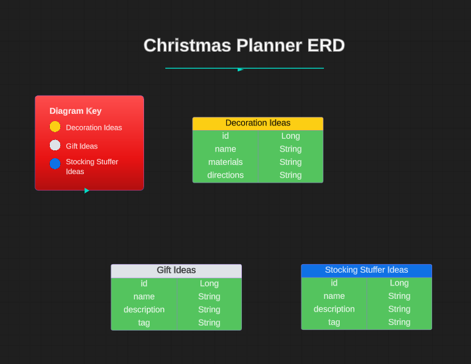

# Christmas Planner Back-End 

Welcome to the Christmas Inspiration API, a RESTful service designed to help users find inspiration for DIY Christmas ornaments, decorations, gift ideas, and stocking stuffers. This API empowers users to explore, contribute, and customize various Christmas-themed projects and concepts, making holiday planning and creativity a delightful experience. 

## About the Christmas Inspiration API 

The Christmas Inspiration API is a powerful tool that allows users to:

Discover Inspiration: Find a wide array of ideas and inspirations for DIY Christmas ornaments, decorations, gifts, and stocking stuffers to make your holiday season even more magical.

Search and Filter: Easily search, filter, and explore through a vast collection of Christmas-themed projects and concepts.

Contribute and Personalize: Users can add and edit their own ideas for DIY decorations, gifts, and stocking stuffers, making it a collaborative platform for holiday creativity. 

## Technologies Used

* <b>Java 17</b>: The programming language used for the API's development, its strong object-oriented principles power the API's robust design and maintainability.

* <b>Maven</b>: The build and project management tool used to streamline the build process. It handles project dependencies, compiles the source code, and manages tasks such as packaging and deployment. 

* <b>Spring Boot</b>: The core framework that streamlines the setup and configuration of Spring-based projects, making it easier to create RESTful services and web applications. 

* <b>Spring Data (JPA)</b>: An integral part of the Spring ecosystem used in combination with Java Persistence API (JPA), it makes it easier to interact with your data source and perform database operations while reducing the amount of boilerplate code.

* <b>H2 Database</b>: A lightweight and in-memory database engine utilized for local development and testing. It offers a simple yet powerful SQL interface for data management without the need for complex database setup.   

* <b>Postman</b>: Used to make API requests, test endpoints, and inspect responses, helping with debugging and validation. 

* <b>Apache Tomcat</b>: Used as the web server or servlet container to deploy and run your Spring Boot application. It serves as the environment where your API can be accessed and utilized.

* <b>MockMVC</b>: A part of the Spring Framework that allows you to perform unit and integration testing on your Spring web application. Its capability to simulate HTTP requests and responses make it essential for testing your API's endpoints.

* <b>JUnit</b>: The primary testing framework for writing unit tests and ensuring that your code functions correctly and reliably. 

* <b>IntelliJ</b>: A popular Integrated Development Environment (IDE) for Java development that provides a powerful and user-friendly environment for coding, debugging, and managing your Spring Boot project.

## Dependencies 

To run this REST API project, you will need to install the following dependencies and tools. This project is built using Java 17, Spring 2.7.16, and utilizes several Spring Boot Starter packages, H2 Database, Spring Data JPA, Spring Web, Spring Boot Dev Tools, and JUnit for testing. Maven is used as the build tool, and the Maven Surefire plugin helps manage project dependencies and testing.

### Java 17 
    
Make sure you have Java 17 or a compatible version installed on your system. You can download and install Java 17 from the official Oracle website or use an OpenJDK distribution.

### Maven

This project uses Apache Maven as the build tool. If you don't have Maven installed, you can download it from the official Apache Maven website: [Download Maven](https://maven.apache.org/download.cgi) 

### Spring Framework

Spring Boot 2.7.16 is the core framework for this project. It includes Spring Data JPA, Spring Web, and Spring Boot Dev Tools. You don't need to install these components separately, as they are managed by Spring Boot.

### H2 Database

H2 Database is used for local development and testing. It is automatically included as a dependency, so you don't need to install it separately.

### JUnit
   
JUnit is used for unit testing in this project. It is included as a dependency and will be used for testing your code.

### Spring Boot Starter Test
   
Spring Boot Starter Test is used to enable testing in a Spring Boot application. It's included as a dependency in this project.

### Maven Surefire Plugin

Maven Surefire Plugin is used to manage dependencies and run tests. You don't need to install it separately; it's configured in the project's pom.xml file. 

## Installation Steps 

Ensure you have Java 17 and Maven installed on your system.

#### Clone this project's repository to your local machine:

    git clone https://github.com/AyalaVirtual/ChristmasPlanner-BackEnd.git

#### Navigate to the project's root directory:

    cd your-project-directory

#### Build the project using Maven. This will download all project dependencies automatically:

    mvn clean install

Once you've completed these steps, you'll have all the necessary dependencies and tools in place to run and develop with this REST API.

## General Approach

I started off by creating my user stories and acceptance criteria. This helped me visualize my end goals and outline what I wanted to achieve with this project. I also created a spreadsheet of all my HTTP methods and API endpoints to keep track of which methods were supposed to hit which endpoint.

For the final step of the planning phase, I created an ERD (entity relationship diagram) to plan my different models and their relevant attributes. This helped me to visualize their individual tables and corresponding attributes in the database.

## Entity Relationship Diagram

## API Endpoints

| Request Type | URL                           | Functionality                        | Access   | 
|-----------|-------------------------------|--------------------------------------|----------|
| POST      | /api/decorations/             | Create a decoration idea             | Public   |
| GET       | /api/decorations/             | Get all decoration ideas             | Public   |
| GET       | /api/decorations/1/           | Get a decoration idea                | Public   |
| POST      | /api/gifts/                   | Create a gift idea                   | Public   |
| GET       | /api/gifts/                   | Get all gift ideas                   | Public   |
| GET       | /api/gifts/1/                 | Get a gift idea                      | Public   |
| POST      | /api/stockingstuffers/        | Creating a stocking stuffer idea     | Public   |
| GET       | /api/stockingstuffers/        | Get all stocking stuffer ideas       | Public   |
| GET       | /api/stockingstuffers/1/      | Get a stocking stuffer idea          | Public   |

## User Stories

<b>User Story 1:</b>
 
As a user I want to view a list of all Christmas decorating ideas so that I can browse for inspiration. (GET all Christmas decorating ideas)

<b>Acceptance Criteria:</b>
 
* User can search for all Christmas decorating ideas.
* Search results should display a list of all Christmas decorating ideas.

<b>User Story 2:</b>
 
As a user I want to view a specific Christmas decorating idea so that I can follow the tutorial and create the decoration. (GET Christmas decorating idea by id)

<b>Acceptance Criteria:</b>
 
* User can click a link from the main page of search results that will bring them to a page with that specific decoration.

<b>User Story 3:</b>
 
As a user I want to add a new Christmas decorating idea so that I can share my decorating ideas with other users. (POST Christmas decorating idea)

<b>Acceptance Criteria:</b>
 
* User can add new Christmas decorating ideas, specifying the name, materials needed, directions, and the URL of an image showing the finished product.
* User can save the Christmas decorating idea to the overall list of Christmas decorating inspiration.

<b>User Story 4:</b>
 
As a user I want to view a list of all gift ideas for inspiration for my Christmas shopping. (GET all gift ideas)

<b>Acceptance Criteria:</b>
 
* User can search for all gift ideas.
* Search results should display a list of all gift ideas.

<b>User Story 5:</b>
 
As a user I want to view a specific gift idea for inspiration for my Christmas shopping. (GET gift idea by id)

<b>Acceptance Criteria:</b>
 
* User can click a link from the main page of search results that will bring them to a page with that specific gift.

<b>User Story 6:</b>
 
As a user I want to add a new gift idea so that I can share my gift ideas with other users. (POST gift idea)

<b>Acceptance Criteria:</b>
 

* User can add new gift ideas, specifying the name, description, and the URL of an image showing the finished product.
* User can save the gift idea to the overall list of gift ideas for inspiration.

<b>User Story 7:</b>
 
As a user I want to view a list of all the stocking stuffer ideas for inspiration for my Christmas shopping. (GET all stocking stuffer ideas)

<b>Acceptance Criteria:</b>
 
* User can search for all stocking stuffer ideas.
* Search results should display a list of all stocking stuffer ideas.

<b>User Story 8:</b>
 
As a user I want to view a specific stocking stuffer idea for inspiration for my Christmas shopping. (GET stocking stuffer idea by id)

<b>Acceptance Criteria:</b>
 
* User can click a link from the main page of search results that will bring them to a page with that specific stocking stuffer.

<b>User Story 9:</b>
 
As a user I want to add a new stocking stuffer idea so that I can share my stocking stuffer ideas with other users. (POST stocking stuffer idea)

<b>Acceptance Criteria:</b>
 
* User can add new stocking stuffer ideas, specifying the name, description, and the URL of an image showing the finished product.
* User can save the stocking stuffer idea to the overall list of stocking stuffer ideas for inspiration.

## Major Hurdles

The only hurdles I had were a few small issues that I ran into during testing, which were caused by a few small mistakes in my service class. After going back over my code to locate and correct those errors, everything ran smoothly. I think my biggest hurdle will be figuring out how to link the front-end (Angular) to the back-end (Java/Spring). 

### Links

* Front-End - https://github.com/AyalaVirtual/ChristmasPlanner-FrontEnd/ 

* User Stories - https://docs.google.com/document/d/1JO308vvk7BKkmmwOgG62_AT4C6tBEFypRaw2r9NPWPM/edit?usp=share_link

* API Endpoints Spreadsheet - https://docs.google.com/spreadsheets/d/12RVyZPDAlmanUx-98VLKu9mCzgStWquStDJq75A0pes/edit?usp=sharing

* ERD (entity relationship diagram) - https://lucid.app/lucidchart/3af0981c-1f3f-40a1-b08e-08b9ec132565/edit?viewport_loc=-571%2C-19%2C3437%2C1426%2C0_0&invitationId=inv_71e906c4-a567-48ff-9051-3689be6f57a8

### Special Thanks

* Leonardo Rodriguez - my instructor who not only taught me all the concepts used to build the front-end of this project (including HTML, CSS, TypeScript, and Angular), but also helped me conquer the issues with routing on the front-end, which turned out to be a major hurdle for me in this project. He helped me spot several errors that were keeping my code from working as intended and helped write the solution to work around the routing issues on the front-end for the GET and POST methods. [GitHub](https://github.com/LRodriguez92) 

* Suresh Sigera - my instructor who taught me all the concepts used to build the back-end of this project, including Java, the Spring framework, and API testing tools such as Postman, MockMVC, and REST-Assured / Cucumber. [GitHub](https://github.com/sureshmelvinsigera)

### Author

:woman_technologist: Erica Ayala

* [LinkedIn](https://www.linkedin.com/in/ayalavirtual)

* [GitHub](https://www.github.com/AyalaVirtual) 

